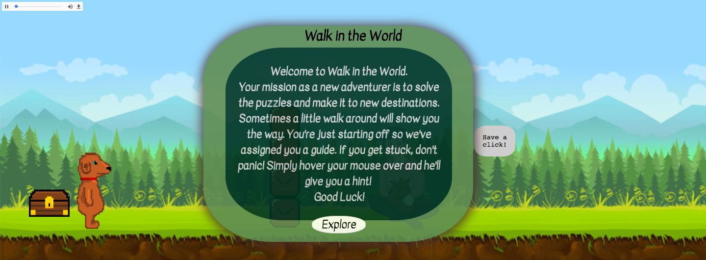
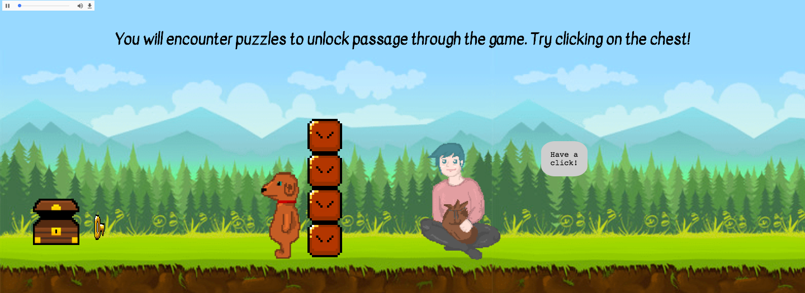
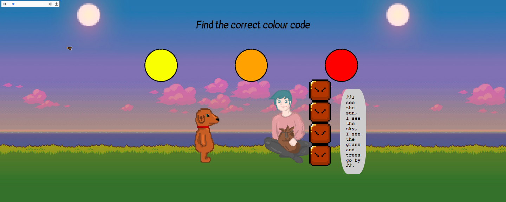
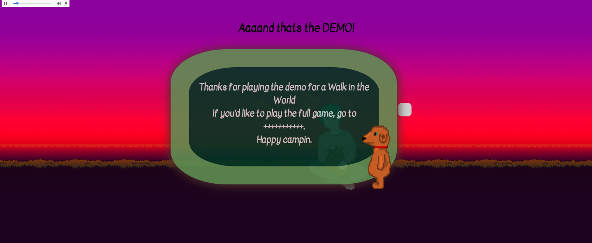
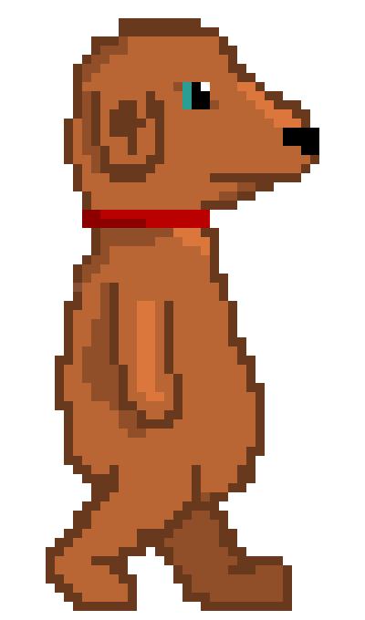
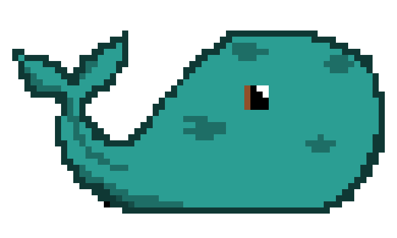

# Walk in the World

# GA WDI-32: Project 1
We were assigned to create a short in-browser game using HTML, CSS and choose between vanilla JavaScript or Jquery, over the course of a 5 day period.
I decided on creating something "original" rather than a remake of an already existing game.

https://walk-in-the-world.herokuapp.com/ 
<em>The game is not mobile responsive.</em>

Setup instructions:
- Clone or download the repo
- Install dependencies with `yarn install`
- Launch the app with `gulp`

>**NB**: You will need to have installed `gulp-cli` globally

Walk in the World is an animated, single level, adventure puzzle game DEMO targeted for ages 6 and above. It's designed to have short and educational levels to try and inspire young kids to be more aware and inquisitive about their surroundings when they're out and about in the outdoors. I believe it important to stimulate the minds of the young through positive interactions, particularly in such dark times.

Level one is hidden behind a short immersive introduction which lets the player know about the guide features and hints that clues are given if the player 'takes a little walk'.

Once hidden, the player is free to hover and interact with objects on the page. For instance, if the player hovers over the guide, a text box appears displaying the commands to move the character we'll refer to as 'Doggy'. Once Doggy moves over a certain position on the page, further hints are given.  

The only way to progress to the next destination is by completing the tasks. The first level explains how the game works, the second is a riddle and the third requires observation and Math.

 Had I had the time to complete the fourth level, user would have 1 minute to locate hidden items on the map in order to create a shelter, however due to the time constriction, I ended the demo on the final background.

As an incomplete adventure game, there isn't a way to "win" the game.
In a way, I'd compare it to a colouring book. Each level requires you to "win" but there is no way to lose.

The doggy and the guide were drawn and animated on a free online pixel maker.
Doggy was drawn 3 times. Stationary, left foot first and right foot first. I then put these images together with a time delay to create a gif. The move commands change the png files to a gif file when its designated key is pressed. I flipped both the png and gif to create the same affect when walking in a different direction.
Simplified for the guide, when his div is hovered over, one png is swapped for another to give the impression of speech.
Sound affects were from various sources. I cut them down and looped a few to ensure I had an immediate and appropriate sound to its designated item.

Background images were sourced from google images. Unfortunately I wasn't able to find the original creators.
Some images were edited in order to fit more appropriately in the game.
There are also some background css issues that require some editing.

I would have been satisfied with the final product had I completed the final level I intended to make. I knew that by creating something that has different win conditions and functionality in every level I would be very constricted with my time. Despite this, I'm fairly happy with the features I was able to implement within the game.

If I were to return to this project I'd have levels that increased in difficulty, adding lives and lose conditions and a feature which allowed you to choose your character at the start of the level (as I had initially created two characters).

I would have also liked to look into vertical scrolling, as this had been my initial wireframe.
